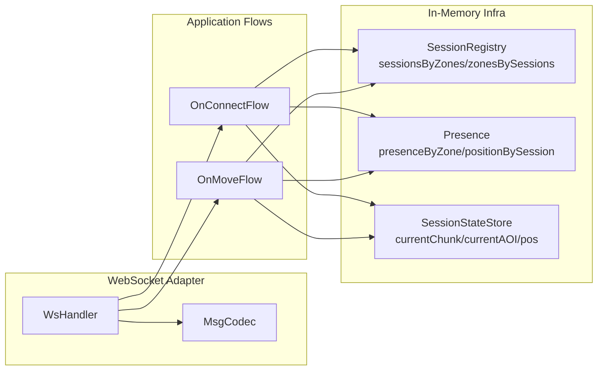
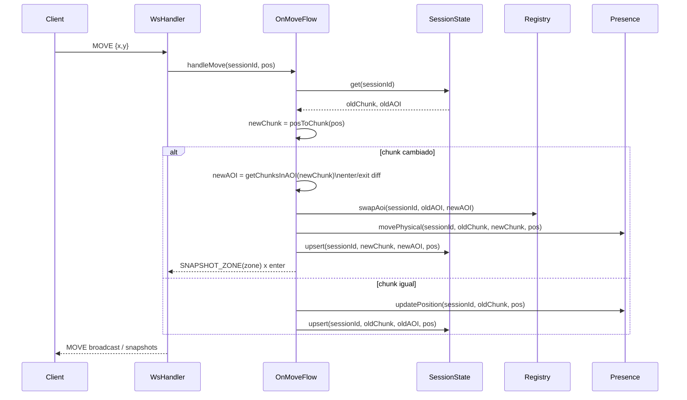

````md
# Decisiones de arquitectura y diseño (TFC-WS)

## Contexto
Backend **WebSocket** (Spring **WebFlux**) para un juego 2D multiplayer. Objetivo del sprint: **AOI por chunks**, suscripciones, presencia en memoria y **snapshots** para que varios jugadores se vean y se muevan en tiempo real.

---

## Decisiones tomadas y qué problema resuelven

### 1) WebFlux + WebSocketHandler (sin Spring MVC / starter-web)
**Decisión:** usar **Spring WebFlux** y un `WebSocketHandler` como entrada principal del realtime.

**Problema que resuelve:**
- Evita colisiones y confusiones de stack al mezclar `starter-web` (MVC) con WebFlux.
- Modelo reactivo coherente (sin bloqueos) para conexiones persistentes (WS).

**Trade-off:**
- Más disciplina: evitar `.block()` dentro del pipeline reactor y diseñar flujos (Flux/Mono) correctamente.

---

### 2) Mundo por chunks + AOI (Area of Interest)
**Decisión:**
- `CHUNK_SIZE = 32`
- `posToChunk = floor(x/32), floor(y/32)`
- **AOI radius = 1** ⇒ 3x3 = **9 zonas** visibles/suscritas

**Problema que resuelve:**
- Limita el broadcast: cada sesión solo recibe lo relevante en su área.
- Escala mejor que “todos con todos” cuando crezca el número de jugadores.

---

### 3) Separación conceptual: **suscripción AOI** vs **presencia física**
**Decisión:**
- **Suscripción (AOI):** una sesión se suscribe a 9 chunks (visibilidad).
- **Presencia física:** un jugador “está” físicamente en **1 chunk** (su chunk actual).

**Problema que resuelve:**
- Detectamos un bug conceptual: meter al jugador en 9 zonas como “presencia” duplicaba su existencia.
- Aclara responsabilidades:
  - AOI → quién recibe info
  - Presencia → qué entidades hay realmente en un chunk

---

### 4) Registro de suscripciones con doble índice + atomicidad por sesión
**Decisión:** `SessionRegistry` mantiene dos vistas:
- `sessionsByZones: ChunkCoord -> Set<sessionId>`
- `zonesBySessions: sessionId -> Set<ChunkCoord>`

Concurrencia:
- `ConcurrentHashMap` + `newKeySet()`
- `ReentrantLock` por `sessionId` para operaciones compuestas atómicas.

**Problema que resuelve:**
- Evita inconsistencias al actualizar ambas vistas (alta/baja/cambio de AOI).
- Asegura que `swapAoi` (enter/exit) sea coherente incluso con concurrencia.

---

### 5) Presencia en memoria orientada a snapshots
**Decisión:** `InMemoryPresence` mantiene:
- `positionBySession: sessionId -> Position`
- `presenceByZone: ChunkCoord -> Map<sessionId, Position>` (presencia física por chunk)

**Problema que resuelve:**
- Construcción eficiente de snapshots por zona.
- Base para despawn/visibility (en el futuro).

---

### 6) Snapshots por zona (estrategia inicial)
**Decisión:** “Snapshot por zona”:
- Cuando una sesión entra a nuevas zonas (enter), el servidor envía `SNAPSHOT_ZONE(zone)`.

**Problema que resuelve:**
- Reduce acoplamiento y complejidad: el cliente pinta lo que hay en la zona que acaba de “descubrir”.
- Evita reenviar el AOI completo cada vez (coste menor que 9 zonas siempre).

**Nota abierta:**
- Si una zona está vacía: se puede **no enviar snapshot** (menos ruido) o enviar snapshot vacío (más determinismo). Pendiente de decidir según UX/debug.

---

### 7) AOI swap dinámico en MOVE (entry/exit)
**Decisión:** en cada `MOVE`:
1. calcular `newChunk`
2. si cambia:
   - `oldAOI vs newAOI`
   - `enter = newAOI - oldAOI`, `exit = oldAOI - newAOI`
   - actualizar SessionRegistry atómicamente
   - mover presencia física (oldChunk → newChunk)
   - enviar snapshots de `enter`

**Problema que resuelve:**
- Mantiene la visibilidad consistente cuando el jugador cruza límites de chunk.
- Permite que dos jugadores que se acercan se “descubran” automáticamente.

---

### 8) Pipeline WS: bus único y `share()` para no leer dos veces
**Decisión:**
- `inboundText = session.receive().map(...).share()`
- `bus = inboundText.flatMap(parseEnvelope...).share()`
- ramas (connect/move/errors/heartbeat) se fusionan en `outbound = Flux.merge(...)`

**Problema que resuelve:**
- Evita “doble lectura” del WebSocket (un inbound solo se puede consumir una vez).
- Permite componer flujos limpios por tipo de mensaje.

---

### 9) Contrato de mensajes: Envelope + codec centralizado
**Decisión:**
- Formato común:
  ```json
  { "type": "...", "payload": { ... } }
````

* `MsgCodec` centraliza parse/encode.

Errores:

* `MsgType.ERROR` con `ErrorPayload`
* `ErrorCode` enum para evitar strings mágicos.

**Problema que resuelve:**

* Simplifica compatibilidad cliente/servidor.
* Manejo estándar de errores sin romper el flujo WS.

---

### 10) Identidad: de `sessionId` → `playerId` (plan)

**Decisión actual:**

* Hoy: `sessionId = WebSocketSession.id()` como identificador en memoria (rápido para iterar).

**Evolución decidida (objetivo del sprint / siguiente):**

* Introducir `playerId` estable + login (user/pass).
* `sessionId` queda como “conexión”; `playerId` como “jugador”.

**Problema que resuelve:**

* Re-conexiones: el jugador mantiene identidad aunque cambie el `sessionId`.
* Permite “join interno” usando última posición persistida (Opción B).

---

## Arquitectura lógica (vista de componentes)



---

## Secuencia: MOVE con cambio de chunk (AOI swap + snapshots)



---

## Problemas encontrados y cómo se resolvieron

1. **Cierre inmediato / flujo WS que no se mantiene vivo**

* Se ajustó la composición `send(outbound).and(inbound.then())` y la estructura del handler para mantener inbound y outbound correctamente.

2. **Bloqueos en reactor (`block()` no permitido)**

* Se eliminó cualquier `.block()` dentro del pipeline.

3. **Presencia duplicada por AOI**

* Se corrigió el modelo: presencia física en 1 chunk; AOI solo para suscripción/snapshots.

4. **Consistencia concurrente en suscripciones**

* Doble índice + lock por sesión para actualizar vistas de forma atómica.

---

## Próximos pasos (alineados con el objetivo de sprint)

1. Introducir `SessionStateStore` y actualizarlo en `OnConnectFlow` + `OnMoveFlow`.
2. Implementar `OnMoveFlow` con AOI swap completo (enter/exit).
3. Migrar de `sessionId` a `playerId` (dev: query param → luego login).
4. Login simple (user/pass) y persistencia de posición por `playerId` para “join interno”.

```
::contentReference[oaicite:0]{index=0}
```
